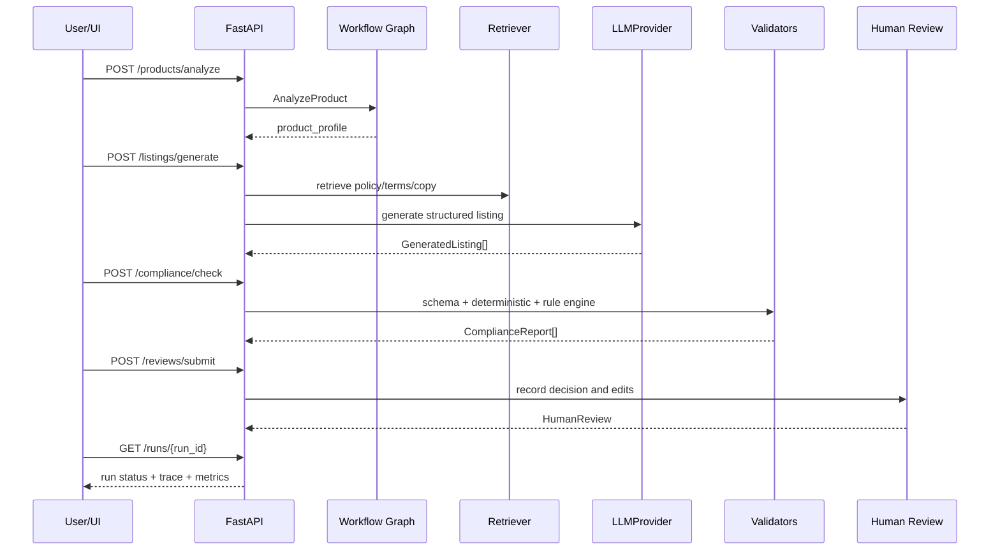

# Mercury API Contract

本文定义 Mercury v1 的最小 API 合同。目标不是模拟所有真实平台接口，而是让面试 Demo 能清楚展示：

1. 商品资料如何进入系统。
2. Listing 如何生成。
3. 合规检查如何独立执行。
4. 人工审核如何形成闭环。
5. 每次 run 如何被追踪、回放和评估。

## 1. 通用约定

### Base URL

```text
http://localhost:8000
```

### 通用响应字段

| 字段 | 类型 | 说明 |
|---|---|---|
| `run_id` | string | 工作流 ID |
| `trace_id` | string | 链路追踪 ID |
| `status` | string | 当前状态 |
| `created_at` | string | ISO 8601 时间 |
| `updated_at` | string | ISO 8601 时间 |

### 错误响应

```json
{
  "error": {
    "code": "VALIDATION_ERROR",
    "message": "target_markets must not be empty",
    "details": [
      {
        "field": "target_markets",
        "reason": "required"
      }
    ]
  },
  "trace_id": "trc_9fd2a1"
}
```

## 2. POST /products/analyze

### 解决的问题

把用户提交的商品资料结构化，识别缺失属性、风险标签和需要检索的上下文。这个接口对应 Agent 的 `AnalyzeProduct` 节点。

### Request

```json
{
  "sku": "SKU-1001",
  "source_language": "zh-CN",
  "title": "便携榨汁杯",
  "description": "适合办公室和户外使用的随身榨汁杯，USB-C 充电。",
  "brand": "Mori",
  "category_hint": "kitchen_appliance",
  "target_markets": ["US", "DE"],
  "target_languages": ["en-US", "de-DE"],
  "attributes": {
    "capacity_ml": 450,
    "material": "Tritan",
    "battery_capacity_mah": 5000,
    "charger_type": "USB-C",
    "color": "white",
    "weight_g": 620
  },
  "image_assets": [
    {
      "url": "mock://images/sku-1001-main.jpg",
      "alt_text": "white portable blender with cup lid",
      "ocr_text": "450ml USB-C Portable Blender"
    }
  ],
  "regulatory_tags": ["battery", "food_contact"]
}
```

### Response

```json
{
  "run_id": "run_20260515_0001",
  "trace_id": "trc_9fd2a1",
  "status": "analyzed",
  "product_profile": {
    "product_id": "prod_1001",
    "sku": "SKU-1001",
    "normalized_category": "kitchen_appliance",
    "source_language": "zh-CN",
    "target_markets": ["US", "DE"],
    "target_languages": ["en-US", "de-DE"],
    "normalized_attributes": {
      "capacity_ml": 450,
      "material": "Tritan",
      "battery_capacity_mah": 5000,
      "charger_type": "USB-C",
      "weight_g": 620
    },
    "detected_risk_tags": ["battery", "food_contact"],
    "missing_attributes": [
      {
        "field": "responsible_person",
        "required_for": ["DE"],
        "severity": "blocker"
      }
    ]
  },
  "next_actions": [
    "generate_listing",
    "retrieve_policy_rules"
  ],
  "created_at": "2026-05-15T09:20:00Z",
  "updated_at": "2026-05-15T09:20:00Z"
}
```

## 3. POST /listings/generate

### 解决的问题

基于结构化商品资料、市场配置、规则片段和历史优秀文案，生成多语言 Listing 草稿。这个接口对应 `RetrieveContext` 和 `GenerateListing` 节点。

### Request

```json
{
  "run_id": "run_20260515_0001",
  "trace_id": "trc_9fd2a1",
  "generation_targets": [
    {
      "market_id": "US",
      "language": "en-US"
    },
    {
      "market_id": "DE",
      "language": "de-DE"
    }
  ],
  "prompt_version": "listing_generator_v1.0.0",
  "llm_options": {
    "provider": "mock_llm",
    "model_name": "qwen3-compatible-demo",
    "temperature": 0.2
  },
  "retrieval_options": {
    "retriever": "mock_retriever",
    "top_k": 5,
    "include_sources": ["policy_chunks", "brand_terms", "approved_copy"]
  }
}
```

### Response

```json
{
  "run_id": "run_20260515_0001",
  "trace_id": "trc_9fd2a1",
  "status": "generated",
  "prompt_version": "listing_generator_v1.0.0",
  "retrieved_chunks": [
    {
      "chunk_id": "policy_eu_gpsr_001",
      "rule_id": "EU_GPSR_RESPONSIBLE_PERSON_REQUIRED",
      "source": "mock_policy_pack",
      "market_id": "DE",
      "score": 0.91,
      "text": "EU market demo policy requires responsible person fields for selected categories."
    },
    {
      "chunk_id": "copy_kitchen_approved_014",
      "rule_id": null,
      "source": "approved_copy",
      "market_id": "US",
      "score": 0.84,
      "text": "Use concise benefit-led bullets and avoid unsupported health claims."
    }
  ],
  "listings": [
    {
      "listing_id": "lst_1001_us",
      "run_id": "run_20260515_0001",
      "trace_id": "trc_9fd2a1",
      "sku": "SKU-1001",
      "market_id": "US",
      "language": "en-US",
      "title": "Portable 450 ml USB-C Blender Cup",
      "bullet_points": [
        "450 ml cup for smoothies, juice and protein drinks",
        "USB-C charging for office, gym and travel use",
        "Tritan cup material based on provided product attributes",
        "Compact body with removable lid for daily routines"
      ],
      "description": "A compact portable blender designed for quick drinks at work, at the gym or while traveling. Review all compliance fields before publishing.",
      "seo_keywords": ["portable blender", "usb c blender", "smoothie cup"],
      "attributes": {
        "capacity_ml": 450,
        "material": "Tritan",
        "battery_capacity_mah": 5000,
        "charger_type": "USB-C"
      },
      "claims": [
        {
          "claim_id": "clm_1001_us_001",
          "text": "for smoothies, juice and protein drinks",
          "claim_type": "usage",
          "source_attribute": null
        }
      ],
      "retrieved_chunks": [
        {
          "chunk_id": "policy_us_claims_001",
          "rule_id": "US_UNSUPPORTED_HEALTH_CLAIM",
          "source": "mock_policy_pack"
        },
        {
          "chunk_id": "policy_battery_001",
          "rule_id": "BATTERY_CAPACITY_FIELD_REQUIRED",
          "source": "mock_policy_pack"
        }
      ],
      "prompt_version": "listing_generator_v1.0.0",
      "model_info": {
        "provider": "mock_llm",
        "model_name": "qwen3-compatible-demo",
        "temperature": 0.2
      },
      "status": "draft"
    },
    {
      "listing_id": "lst_1001_de",
      "run_id": "run_20260515_0001",
      "trace_id": "trc_9fd2a1",
      "sku": "SKU-1001",
      "market_id": "DE",
      "language": "de-DE",
      "title": "Tragbarer Mixer 450 ml mit USB-C-Ladung",
      "bullet_points": [
        "450 ml Becher fuer Smoothies, Saefte und Proteinshakes",
        "USB-C-Ladung fuer flexible Nutzung im Buero oder unterwegs",
        "Tritan-Becher fuer den Kontakt mit Lebensmitteln geeignet",
        "Kompaktes Design mit abnehmbarem Deckel"
      ],
      "description": "Dieser tragbare Mixer ist fuer schnelle Getraenke im Alltag konzipiert. Die Produktinformationen sollten vor der Veroeffentlichung geprueft werden.",
      "seo_keywords": ["tragbarer mixer", "usb c mixer", "smoothie becher"],
      "attributes": {
        "capacity_ml": 450,
        "material": "Tritan",
        "battery_capacity_mah": 5000,
        "charger_type": "USB-C",
        "responsible_person": null
      },
      "claims": [
        {
          "claim_id": "clm_1001_de_001",
          "text": "fuer den Kontakt mit Lebensmitteln geeignet",
          "claim_type": "food_contact",
          "source_attribute": "material"
        }
      ],
      "retrieved_chunks": [
        {
          "chunk_id": "policy_eu_gpsr_001",
          "rule_id": "EU_GPSR_RESPONSIBLE_PERSON_REQUIRED",
          "source": "mock_policy_pack"
        },
        {
          "chunk_id": "policy_food_contact_001",
          "rule_id": "FOOD_CONTACT_MATERIAL_DISCLOSURE",
          "source": "mock_policy_pack"
        }
      ],
      "prompt_version": "listing_generator_v1.0.0",
      "model_info": {
        "provider": "mock_llm",
        "model_name": "qwen3-compatible-demo",
        "temperature": 0.2
      },
      "status": "draft"
    }
  ],
  "model_info": {
    "provider": "mock_llm",
    "model_name": "qwen3-compatible-demo",
    "input_tokens": 3200,
    "output_tokens": 1100,
    "latency_ms": 1800
  },
  "created_at": "2026-05-15T09:25:00Z",
  "updated_at": "2026-05-15T09:25:00Z"
}
```

## 4. POST /compliance/check

### 解决的问题

对生成草稿执行结构、规则、敏感词、单位和图文一致性校验。这个接口对应 `ValidateListing` 节点。

### Request

```json
{
  "run_id": "run_20260515_0001",
  "trace_id": "trc_9fd2a1",
  "listing_ids": ["lst_1001_us", "lst_1001_de"],
  "policy_version": "demo-policy-2026-05",
  "check_options": {
    "json_schema": true,
    "deterministic_validators": true,
    "rule_engine": true,
    "image_text_consistency": true
  }
}
```

### Response

```json
{
  "run_id": "run_20260515_0001",
  "trace_id": "trc_9fd2a1",
  "status": "checked",
  "policy_version": "demo-policy-2026-05",
  "reports": [
    {
      "report_id": "rpt_1001_us",
      "listing_id": "lst_1001_us",
      "overall_status": "warning",
      "score": 88,
      "policy_version": "demo-policy-2026-05",
      "retrieved_chunks": [
        {
          "chunk_id": "policy_battery_001",
          "rule_id": "BATTERY_CAPACITY_FIELD_REQUIRED",
          "source": "mock_policy_pack",
          "score": 0.82
        }
      ],
      "checks": [
        {
          "check_id": "chk_us_title_length",
          "rule_id": "TITLE_LENGTH_BY_MARKET",
          "status": "passed",
          "severity": "warning",
          "message": "标题长度符合 US mock 限制。",
          "evidence": {
            "length": 34,
            "max_length": 150
          },
          "suggested_fix": null
        },
        {
          "check_id": "chk_battery_disclosure",
          "rule_id": "BATTERY_CAPACITY_FIELD_REQUIRED",
          "status": "warning",
          "severity": "warning",
          "message": "商品包含电池属性，建议在导出 payload 中保留 battery_capacity_mah。",
          "evidence": {
            "battery_capacity_mah": 5000
          },
          "suggested_fix": "确认平台字段中包含 battery_capacity_mah。"
        }
      ],
      "validator_result": {
        "json_schema_passed": true,
        "deterministic_validators_passed": true,
        "failed_validator_count": 0,
        "warning_count": 1,
        "blocker_count": 0
      }
    },
    {
      "report_id": "rpt_1001_de",
      "listing_id": "lst_1001_de",
      "overall_status": "blocker",
      "score": 72,
      "policy_version": "demo-policy-2026-05",
      "retrieved_chunks": [
        {
          "chunk_id": "policy_eu_gpsr_001",
          "rule_id": "EU_GPSR_RESPONSIBLE_PERSON_REQUIRED",
          "source": "mock_policy_pack",
          "score": 0.91
        }
      ],
      "checks": [
        {
          "check_id": "chk_required_responsible_person",
          "rule_id": "EU_GPSR_RESPONSIBLE_PERSON_REQUIRED",
          "status": "failed",
          "severity": "blocker",
          "message": "EU 市场缺少 responsible_person 字段。",
          "evidence": {
            "field": "attributes.responsible_person",
            "value": null
          },
          "suggested_fix": "补充 EU 负责人信息，或在 Demo 中使用 Mock 责任主体。"
        }
      ],
      "validator_result": {
        "json_schema_passed": true,
        "deterministic_validators_passed": false,
        "failed_validator_count": 1,
        "warning_count": 0,
        "blocker_count": 1
      }
    }
  ],
  "next_actions": [
    "human_review",
    "fix_blockers"
  ],
  "created_at": "2026-05-15T09:30:00Z",
  "updated_at": "2026-05-15T09:30:00Z"
}
```

## 5. POST /reviews/submit

### 解决的问题

记录人工审核结论，把“生成草稿”转成可评估、可导出的业务结果。这个接口对应 `PrepareReview`、`HumanReviewing` 和可选 `ExportPayload` 节点。

### Request

```json
{
  "run_id": "run_20260515_0001",
  "trace_id": "trc_9fd2a1",
  "listing_id": "lst_1001_de",
  "reviewer_id": "reviewer_demo_01",
  "decision": "changes_requested",
  "edited_listing": {
    "title": "Tragbarer Mixer 450 ml mit USB-C-Ladung",
    "bullet_points": [
      "450 ml Becher fuer Smoothies und Saefte",
      "USB-C-Ladung fuer flexible Nutzung",
      "Tritan-Becher; Materialangaben vor Veroeffentlichung pruefen"
    ],
    "attributes": {
      "responsible_person": {
        "name": "Demo EU Responsible Person GmbH",
        "address": "Mockstrasse 1, 10115 Berlin, Germany"
      }
    }
  },
  "comments": "补充 EU responsible_person，并弱化食品接触安全表述。",
  "human_review_result": {
    "quality_score": 4,
    "compliance_confidence": "medium",
    "needs_regeneration": true,
    "failure_tags": ["missing_required_field", "claim_too_strong"]
  }
}
```

### Response

```json
{
  "run_id": "run_20260515_0001",
  "trace_id": "trc_9fd2a1",
  "status": "revision_requested",
  "review": {
    "review_id": "rev_1001_de",
    "run_id": "run_20260515_0001",
    "trace_id": "trc_9fd2a1",
    "listing_id": "lst_1001_de",
    "reviewer_id": "reviewer_demo_01",
    "decision": "changes_requested",
    "comments": "补充 EU responsible_person，并弱化食品接触安全表述。",
    "edit_summary": {
      "title_changed": false,
      "bullet_points_changed": true,
      "description_changed": false,
      "attributes_changed": true,
      "estimated_edit_rate": 0.18
    },
    "human_review_result": {
      "quality_score": 4,
      "compliance_confidence": "medium",
      "needs_regeneration": true,
      "failure_tags": ["missing_required_field", "claim_too_strong"]
    },
    "reviewed_at": "2026-05-15T09:45:00Z"
  },
  "next_actions": [
    "regenerate_with_review_feedback",
    "rerun_compliance_check"
  ],
  "created_at": "2026-05-15T09:45:00Z",
  "updated_at": "2026-05-15T09:45:00Z"
}
```

### Approved 示例

```json
{
  "run_id": "run_20260515_0002",
  "trace_id": "trc_7ab3c9",
  "status": "approved",
  "review": {
    "review_id": "rev_1002_us",
    "run_id": "run_20260515_0002",
    "trace_id": "trc_7ab3c9",
    "listing_id": "lst_1002_us",
    "reviewer_id": "reviewer_demo_01",
    "decision": "approved",
    "edit_summary": {
      "estimated_edit_rate": 0.06
    },
    "human_review_result": {
      "quality_score": 5,
      "compliance_confidence": "high",
      "needs_regeneration": false,
      "failure_tags": []
    },
    "reviewed_at": "2026-05-15T10:10:00Z"
  },
  "export_payloads": {
    "csv_url": "mock://exports/run_20260515_0002.csv",
    "json_url": "mock://exports/run_20260515_0002.json",
    "shopify_like_payload_url": "mock://exports/run_20260515_0002_shopify_like.json"
  }
}
```

## 6. GET /runs/{run_id}

### 解决的问题

给 Demo UI 和面试讲解提供单一查询入口，展示一次工作流的状态、生成结果、校验结果、人工审核和可观测信息。

### Request

```http
GET /runs/run_20260515_0001
```

### Response

```json
{
  "run_id": "run_20260515_0001",
  "trace_id": "trc_9fd2a1",
  "status": "revision_requested",
  "current_state": "HUMAN_REVIEWING",
  "product_profile": {
    "sku": "SKU-1001",
    "normalized_category": "kitchen_appliance",
    "target_markets": ["US", "DE"],
    "detected_risk_tags": ["battery", "food_contact"]
  },
  "listings": [
    {
      "listing_id": "lst_1001_us",
      "market_id": "US",
      "language": "en-US",
      "status": "checked"
    },
    {
      "listing_id": "lst_1001_de",
      "market_id": "DE",
      "language": "de-DE",
      "status": "revision_requested"
    }
  ],
  "compliance_reports": [
    {
      "report_id": "rpt_1001_us",
      "listing_id": "lst_1001_us",
      "overall_status": "warning",
      "score": 88
    },
    {
      "report_id": "rpt_1001_de",
      "listing_id": "lst_1001_de",
      "overall_status": "blocker",
      "score": 72
    }
  ],
  "reviews": [
    {
      "review_id": "rev_1001_de",
      "listing_id": "lst_1001_de",
      "decision": "changes_requested",
      "estimated_edit_rate": 0.18
    }
  ],
  "observability": {
    "prompt_version": "listing_generator_v1.0.0",
    "policy_version": "demo-policy-2026-05",
    "retrieved_chunks": [
      {
        "chunk_id": "policy_eu_gpsr_001",
        "source": "mock_policy_pack",
        "score": 0.91
      }
    ],
    "validator_result": {
      "json_schema_passed": true,
      "failed_validator_count": 1,
      "warning_count": 1,
      "blocker_count": 1
    },
    "human_review_result": {
      "quality_score": 4,
      "needs_regeneration": true,
      "failure_tags": ["missing_required_field", "claim_too_strong"]
    },
    "latency_ms": {
      "analyze": 120,
      "retrieve": 90,
      "generate": 1800,
      "check": 160
    }
  },
  "created_at": "2026-05-15T09:20:00Z",
  "updated_at": "2026-05-15T09:45:00Z"
}
```

## 7. 端到端调用顺序



## 8. v1 Adapter 边界

当前 API 不调用真实平台。导出相关字段只生成 mock payload：

- `csv_url`: 指向本地或 mock 存储中的 CSV。
- `json_url`: 指向结构化 JSON。
- `shopify_like_payload_url`: Shopify-like JSON，不代表真实 Shopify Admin API 请求。

面试解释口径：真实接入不是难点的全部，难点是先把生成、校验、审核、评估这些不可省略的核心链路做稳。Adapter 保留后，真实 API 接入是工程替换问题，不改变系统架构。
