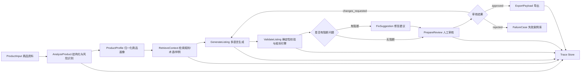
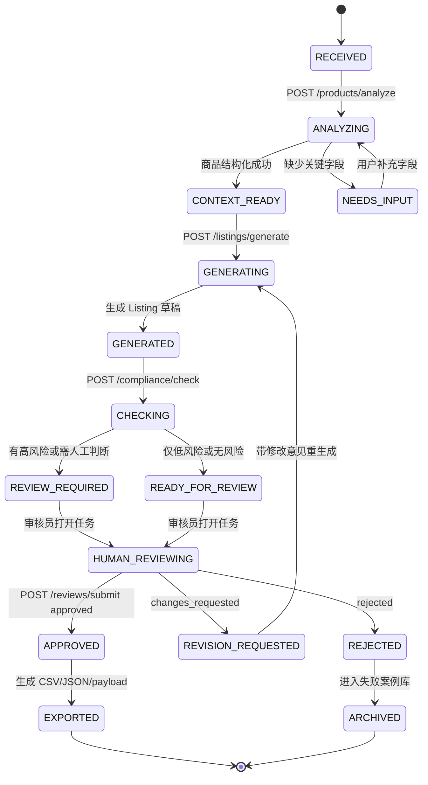

# Mercury 多语种商品上新与合规增长 Agent 架构设计

## 1. 项目背景

Mercury 是一个面向作品集和面试演示的 Business Simulation Project。它选择跨境电商上新作为业务场景，但核心不是“帮卖家写文案”，而是展示一套可迁移的 LLM 应用架构：多语言内容生成、规则检索、确定性校验、人工审核、导出适配和可观测评估。

第一性原理看，跨境商品上新的本质是把不完整、非结构化、跨语言的商品资料，转化为发布前可审核、可导出、可追溯的结构化内容。这个过程同时受到平台规则、品牌术语、目标市场语言、单位格式、敏感词和合规字段约束。单纯让模型“生成一段英文 Listing”无法覆盖这些风险。

本项目的面试价值在于：

- 业务上能解释：多市场上新慢、错误多、人工复核成本高。
- 技术上能解释：LLM 只负责不确定性较高的语言生成和推理，规则、结构、审计由工程系统兜底。
- 风险上能解释：不把模型输出直接发布，所有高风险动作进入校验和人工审核。
- 迁移上能解释：同一架构可迁移到内容平台、广告素材平台、多语言 CMS、SaaS 企业 Agent。

## 2. 目标用户

| 用户 | 主要痛点 | Mercury 解决方式 |
|---|---|---|
| 跨境运营 | 单 SKU 多语言上新耗时，容易漏字段 | 结构化商品信息，生成多市场草稿，输出缺失字段 |
| 商品内容专员 | 标题、卖点、详情需要本地化 | 使用目标市场配置、术语库和历史优秀文案约束生成 |
| 合规/质检人员 | 人工检查规则分散且不可追溯 | 输出规则命中、证据、严重程度和修复建议 |
| 小团队 owner | 无法建立完整内容团队 | 提供“可复核草稿”而不是黑盒自动发布 |
| 面试官 | 关心项目是否真实、可扩展、能防击穿 | 展示状态机、Adapter、评估指标和可观测字段 |

## 3. 核心问题

Mercury 解决的是“受规则约束的多语言内容发布”问题，而不是泛化的文本生成问题。

核心问题拆成五类：

1. 输入不稳定：用户可能只给中文标题、少量规格和图片，属性缺失严重。
2. 规则分散：不同市场、平台、类目要求不同，规则经常变化。
3. 语言风险：翻译不能只追求通顺，还要保留品牌术语、单位格式和限制性声明。
4. 合规风险：敏感词、医疗功效、环保声明、食品接触、电池运输等错误会导致拒登或处罚。
5. 责任边界：模型可能幻觉，系统必须能回溯 prompt、检索片段、规则版本和人工审核结果。

## 4. 为什么需要 Agent，而不是普通脚本

普通脚本适合输入、规则和输出都稳定的单步流程。Mercury 的流程不是单步转换，而是多阶段、有分支、有反馈的工作流。

需要 Agent 的原因：

- 任务有状态：输入解析、检索、生成、校验、人审、导出之间需要共享 `run_id`、商品属性、检索证据和校验结果。
- 任务有分支：属性缺失时进入补全建议；高危合规问题进入人工复核；低危格式问题可自动修复后重检。
- 任务要调工具：Retriever、LLMProvider、JSON Schema validator、rule engine、image OCR mock、export adapter 都是独立工具。
- 任务要可恢复：某一步失败时，不应该重跑整个流程，而是从失败节点恢复或进入人工处理。
- 任务要可解释：面试时能讲清每个节点的输入、输出、失败模式和兜底策略。

因此 Mercury 使用 LangGraph 风格的显式 workflow graph。PoC 阶段可以自己实现轻量状态机，不强依赖 LangGraph；但设计语义保持一致。

## 5. 系统模块

### 5.1 Frontend / Demo UI

解决的问题：让面试官看到完整业务闭环，而不是只看 API 文档。

建议能力：

- 商品录入页：SKU、标题、规格、目标市场、目标语言、类目提示、图片 URL。
- Run 详情页：展示状态机进度、检索片段、生成草稿、合规报告。
- 人工审核页：接受、驳回、编辑标题/卖点/详情，记录修改率。
- 导出页：下载 CSV / JSON / Shopify-like payload。

技术选择：Next.js 可选。若时间紧，先用 FastAPI docs + 简单静态页面也可演示核心能力。

### 5.2 Backend API

解决的问题：把 Agent 能力封装成稳定接口，避免 Demo 只是脚本。

技术选择：FastAPI。理由是：

- Pydantic 能直接表达 schema 和校验边界。
- OpenAPI 文档天然适合面试演示。
- 后续接 Celery、Redis、PostgreSQL、LLM Provider 都直接。

### 5.3 Workflow Engine

解决的问题：控制多步 Agent 执行，而不是让模型自由决定一切。

核心节点：

- `AnalyzeProduct`：结构化商品输入，识别缺失字段和风险标签。
- `RetrieveContext`：检索平台规则、品牌术语、历史优秀文案。
- `GenerateListing`：按市场和语言生成 Listing 草稿。
- `ValidateListing`：执行 schema、规则、敏感词、单位、图文一致性校验。
- `PrepareReview`：汇总草稿和报告，进入人工审核。
- `ExportPayload`：生成 CSV / JSON / Shopify-like API payload。

### 5.4 Retrieval Layer

解决的问题：减少模型凭空编规则，给生成和校验提供可引用上下文。

v1 实现边界：

- 可先用 mock retriever 或本地 FAISS。
- 接口保持向量库无关，后续可替换 Milvus。
- 检索对象包括 `policy_chunks`、`brand_terms`、`approved_copy`。

RAG 在本项目中的作用不是“让回答更丰富”，而是把模型限制在可追溯的规则和样例范围内。

### 5.5 LLM Provider

解决的问题：模型能力会变、成本会变，系统不能绑定某一个模型。

设计方式：

- 定义 `LLMProvider` 抽象，输入 prompt、schema、temperature、trace context。
- 返回结构化 JSON，不直接返回自由文本。
- 记录 `model_name`、`prompt_version`、`input_tokens`、`output_tokens`、`latency_ms`。

PoC 可用任何兼容接口；文档中把 Qwen3 / GPT / Claude / 本地 vLLM 都视为可替换 Provider。

### 5.6 Validation Layer

解决的问题：LLM 擅长生成，不擅长保证格式、数值、规则和责任边界。

校验分三层：

- JSON Schema：字段是否存在、类型是否正确、枚举是否合法。
- Deterministic validators：单位换算、标题长度、禁用词、必填属性、语言代码、货币代码。
- Rule engine：按市场、类目、风险标签执行版本化规则。

规则引擎不是为了炫技，而是为了把“必须正确”的判断从模型里拿出来。

### 5.7 Human Review

解决的问题：PoC 可以展示自动化能力，但不能假装模型可以无责任发布。

人审机制：

- `approved`：内容可导出。
- `changes_requested`：退回生成或人工编辑。
- `rejected`：标记失败案例，进入评估集。

人工修改会被记录为 `human_review_result`，用于计算人工修改率和发现模型薄弱点。

### 5.8 Export Adapters

解决的问题：当前阶段不接真实平台，但要证明系统边界能对接真实平台。

v1 只实现：

- CSV export。
- JSON export。
- Shopify-like payload mock。

不实现真实 Shopify、Google Merchant、Amazon API 调用。这样能避免账号、权限、API 变更和合规风险，同时保留工程接口。

### 5.9 Observability

解决的问题：Agent 出错时必须知道是哪一步错、为什么错、能否复现。

每次 run 固定记录：

- `run_id`
- `trace_id`
- `prompt_version`
- `retrieved_chunks`
- `validator_result`
- `human_review_result`
- `model_name`
- `policy_version`
- `latency_ms`
- `status`

面试解释口径：我不把“生成效果好”作为唯一指标，而是把每次生成变成可审计、可回放、可评估的工程事件。

## 6. 数据流

## 7. Agent 状态图

## 8. 技术选型理由

| 技术 | v1 选择 | 选择理由 | 防击穿说明 |
|---|---|---|---|
| Backend | FastAPI | 快速表达 API、schema、OpenAPI | 不是只写脚本，接口可演示 |
| Database | PostgreSQL | 存 run、review、schema、metrics | PoC 可先 SQLite，但设计按 Postgres |
| Retrieval | Mock / FAISS，预留 Milvus | 降低起步成本，保留向量库替换能力 | 面试时承认 v1 不需要重型 Milvus |
| Agent | 显式 workflow graph | 可控、可恢复、可解释 | 不让 LLM 自由规划高风险动作 |
| LLM | Provider 抽象 | 模型可替换，便于成本和效果对比 | 不把项目绑定到单一模型叙事 |
| Validation | JSON Schema + validators + rule engine | 必须正确的逻辑交给确定性系统 | 幻觉不能靠 prompt 解决 |
| Observability | trace + metrics + failure cases | 生成链路可回放、可评估 | 证明知道真实系统风险 |
| Export | CSV / JSON / Shopify-like mock | 足够演示业务闭环 | 明确不接真实平台 API |

## 9. 非目标 / 暂不实现范围

当前阶段明确不做：

- 不接真实 Shopify、Google Merchant、Amazon API。
- 不处理真实支付、订单、客户 PII。
- 不承诺法律意义上的合规结论，只做合规预检和风险提示。
- 不做完整多模态图像理解，v1 只支持图片 URL、Mock OCR 或人工录入 OCR 文本。
- 不做自动发布到线上平台。
- 不做复杂权限系统，只保留 reviewer/admin 的概念字段。
- 不做分布式高并发架构，PoC 以可解释和可演示优先。
- 不追求覆盖所有类目，v1 建议选择 2-3 个类目，例如厨房用品、消费电子配件、美妆个护。

这些非目标不是能力不足，而是作品集 PoC 的边界控制。过早接真实平台 API 会让项目重点从 Agent 工程能力偏移到账户、权限和平台细节。

## 10. 风险与缓解措施

| 风险 | 具体表现 | 缓解措施 |
|---|---|---|
| 模型幻觉 | 编造规则、夸大功效、生成不存在的属性 | RAG 只提供版本化规则；属性必须来自输入或明确标记为建议；高风险声明由规则引擎拦截 |
| 合规误判 | 漏掉敏感词或误报普通文案 | 评估 precision/recall；规则分 severity；人工复核高风险项 |
| 多语言质量不稳定 | 翻译直译、本地化差、术语不一致 | 术语表、历史优秀文案、语言质量 rubric、人工修改率反馈 |
| 规则变更 | 平台政策更新后旧规则失效 | `policy_version`、规则包热更新、失败案例回归测试 |
| Mock 被质疑 | 面试官认为没接真实 API 不真实 | 解释 Adapter 边界、payload shape、真实接入风险和后续替换成本 |
| 过度工程化 | 为 PoC 堆太多中间件 | v1 用 Mock/FAISS/同步任务，设计保留替换点；实现只做能演示闭环的最小集合 |
| 无法解释效果 | 只有生成结果，没有指标 | 记录属性完整率、合规识别、人工修改率、review 结果和 trace |
| 数据安全 | 商品资料或客户信息进入模型日志 | PoC 不采集 PII；Provider 调用前脱敏；trace 只存摘要和哈希 |

## 11. 面试中的一句话定位

Mercury 是一个面向多市场内容发布前检查的 Agent 系统：它把商品资料转成可审核、可导出的多语言 Listing 草稿，但真正的亮点是用 RAG 限制知识边界、用规则引擎做确定性校验、用人工审核控制发布风险、用可观测与评估体系持续改进模型表现。跨境电商只是业务样本，底层能力可以迁移到内容平台、广告平台、SaaS 和企业 Agent 场景。
