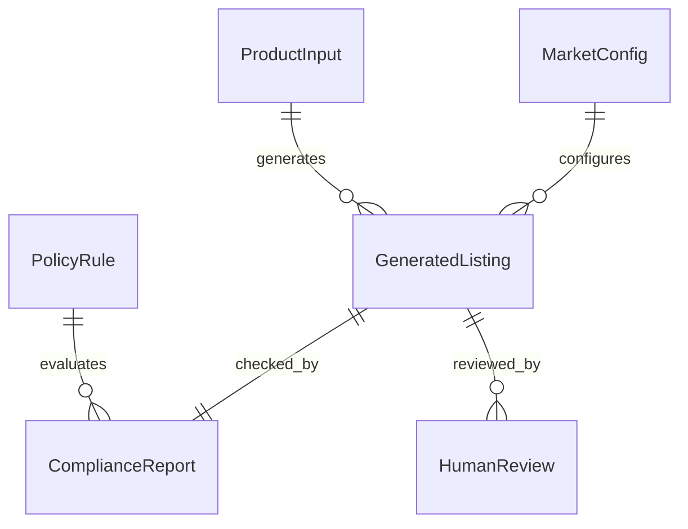

# Mercury 数据 Schema 设计

本文定义 Mercury v1 的核心数据结构。设计原则是：LLM 可以参与生成，但系统必须用结构化 schema 管住输入、输出、校验和审核结果。

所有对象建议包含以下通用追踪字段：

| 字段 | 类型 | 说明 |
|---|---|---|
| `run_id` | string | 一次端到端工作流 ID |
| `trace_id` | string | 可观测链路 ID |
| `created_at` | string | ISO 8601 时间 |
| `updated_at` | string | ISO 8601 时间 |

## 1. ProductInput

### 解决的问题

用户输入通常不完整、不统一。`ProductInput` 的作用是把“商品资料”收敛为可校验、可检索、可生成的结构。

### Schema

| 字段 | 类型 | 必填 | 说明 |
|---|---|---:|---|
| `product_id` | string | 否 | 内部商品 ID，缺省可由系统生成 |
| `sku` | string | 是 | 商品唯一 SKU |
| `source_language` | string | 是 | 原始资料语言，例如 `zh-CN` |
| `title` | string | 是 | 原始商品标题 |
| `description` | string | 否 | 原始描述 |
| `brand` | string | 否 | 品牌名 |
| `category_hint` | string | 是 | 用户给出的类目提示 |
| `target_markets` | array[string] | 是 | 目标市场，例如 `US`、`DE` |
| `target_languages` | array[string] | 是 | 目标语言，例如 `en-US`、`de-DE` |
| `attributes` | object | 否 | 商品属性，允许类目差异 |
| `image_assets` | array[object] | 否 | 图片 URL、alt、OCR 文本 |
| `regulatory_tags` | array[string] | 否 | 风险标签，例如 `battery`、`food_contact` |
| `source_metadata` | object | 否 | 来源系统、上传人、批次等 |

### JSON 示例

```json
{
  "product_id": "prod_1001",
  "sku": "SKU-1001",
  "source_language": "zh-CN",
  "title": "便携榨汁杯",
  "description": "适合办公室和户外使用的随身榨汁杯，USB-C 充电。",
  "brand": "Mori",
  "category_hint": "kitchen_appliance",
  "target_markets": ["US", "DE"],
  "target_languages": ["en-US", "de-DE"],
  "attributes": {
    "capacity_ml": 450,
    "material": "Tritan",
    "battery_capacity_mah": 5000,
    "charger_type": "USB-C",
    "color": "white",
    "weight_g": 620
  },
  "image_assets": [
    {
      "url": "mock://images/sku-1001-main.jpg",
      "alt_text": "white portable blender with cup lid",
      "ocr_text": "450ml USB-C Portable Blender"
    }
  ],
  "regulatory_tags": ["battery", "food_contact"],
  "source_metadata": {
    "source": "manual_upload",
    "uploaded_by": "demo_user",
    "batch_id": "batch_20260515"
  }
}
```

## 2. MarketConfig

### 解决的问题

不同市场有不同语言、单位、币种、必填字段和规则包。`MarketConfig` 避免把市场差异写死在 prompt 里。

### Schema

| 字段 | 类型 | 必填 | 说明 |
|---|---|---:|---|
| `market_id` | string | 是 | 市场 ID，例如 `US` |
| `region` | string | 是 | 区域，例如 `NA`、`EU` |
| `country_code` | string | 是 | ISO 国家代码 |
| `language` | string | 是 | 默认目标语言 |
| `currency` | string | 是 | 默认币种 |
| `unit_system` | string | 是 | `metric` 或 `imperial` |
| `platform` | string | 是 | `shopify_mock`、`merchant_mock` 等 |
| `required_attributes` | array[string] | 是 | 当前市场/类目必填属性 |
| `forbidden_claims` | array[string] | 否 | 禁止或高风险声明 |
| `locale_rules` | object | 否 | 标题长度、标点、单位格式 |
| `compliance_profile` | object | 是 | 规则包和版本 |
| `export_profile` | object | 是 | 导出字段映射 |

### JSON 示例

```json
{
  "market_id": "DE",
  "region": "EU",
  "country_code": "DE",
  "language": "de-DE",
  "currency": "EUR",
  "unit_system": "metric",
  "platform": "shopify_mock",
  "required_attributes": [
    "material",
    "capacity_ml",
    "battery_capacity_mah",
    "manufacturer_name",
    "responsible_person"
  ],
  "forbidden_claims": [
    "medical_cure",
    "guaranteed_weight_loss",
    "100_percent_safe"
  ],
  "locale_rules": {
    "max_title_length": 140,
    "decimal_separator": ",",
    "measurement_units": ["ml", "cm", "g"]
  },
  "compliance_profile": {
    "policy_version": "demo-policy-2026-05",
    "rule_sets": ["eu_general_product_safety", "battery_shipping", "food_contact_materials"]
  },
  "export_profile": {
    "format": "shopify_like_json",
    "required_fields": ["title", "description_html", "vendor", "tags", "metafields"]
  }
}
```

## 3. PolicyRule

### 解决的问题

合规要求不能只写在 prompt 里。`PolicyRule` 把规则版本、适用条件、严重程度和修复建议结构化，便于热更新、回归测试和审计。

### Schema

| 字段 | 类型 | 必填 | 说明 |
|---|---|---:|---|
| `rule_id` | string | 是 | 规则唯一 ID |
| `version` | string | 是 | 规则版本 |
| `market_ids` | array[string] | 是 | 适用市场 |
| `category_scope` | array[string] | 否 | 适用类目 |
| `rule_type` | string | 是 | `required_field`、`forbidden_claim`、`unit_format` 等 |
| `severity` | string | 是 | `blocker`、`warning`、`info` |
| `source` | object | 是 | 规则来源和链接 |
| `condition` | object | 是 | 触发条件 |
| `check` | object | 是 | 校验逻辑描述 |
| `message` | string | 是 | 命中后的展示文案 |
| `remediation` | string | 是 | 修复建议 |
| `examples` | array[object] | 否 | 正反例 |

### JSON 示例

```json
{
  "rule_id": "EU_GPSR_RESPONSIBLE_PERSON_REQUIRED",
  "version": "demo-policy-2026-05",
  "market_ids": ["DE", "FR", "ES", "IT"],
  "category_scope": ["kitchen_appliance", "consumer_electronics"],
  "rule_type": "required_field",
  "severity": "blocker",
  "source": {
    "name": "EU GPSR demo rule pack",
    "url": "mock://policy/eu-gpsr/responsible-person"
  },
  "condition": {
    "all": [
      {"field": "market.region", "operator": "equals", "value": "EU"},
      {"field": "product.regulatory_tags", "operator": "contains_any", "value": ["battery", "food_contact"]}
    ]
  },
  "check": {
    "field": "listing.attributes.responsible_person",
    "operator": "exists"
  },
  "message": "EU 市场需要提供负责人或责任主体字段。",
  "remediation": "补充 responsible_person，包括名称、地址或可联系信息；PoC 中可使用 Mock 企业信息。",
  "examples": [
    {
      "type": "invalid",
      "text": "EU listing without responsible_person"
    },
    {
      "type": "valid",
      "text": "responsible_person.name and responsible_person.address are present"
    }
  ]
}
```

## 4. GeneratedListing

### 解决的问题

生成结果必须既能展示给人审，也能被机器校验和导出。`GeneratedListing` 不保存一整段不可解析文本，而是保存结构化 Listing。

### Schema

| 字段 | 类型 | 必填 | 说明 |
|---|---|---:|---|
| `listing_id` | string | 是 | Listing ID |
| `run_id` | string | 是 | 工作流 ID |
| `trace_id` | string | 是 | 链路 ID |
| `sku` | string | 是 | SKU |
| `market_id` | string | 是 | 目标市场 |
| `language` | string | 是 | 目标语言 |
| `title` | string | 是 | 本地化标题 |
| `bullet_points` | array[string] | 是 | 卖点 |
| `description` | string | 是 | 商品详情 |
| `seo_keywords` | array[string] | 否 | SEO 关键词 |
| `attributes` | object | 是 | 生成后属性 |
| `claims` | array[object] | 否 | 文案中的声明，用于合规检查 |
| `retrieved_chunks` | array[object] | 是 | 生成时使用的检索片段 |
| `prompt_version` | string | 是 | prompt 版本 |
| `model_info` | object | 是 | 模型信息 |
| `export_payloads` | object | 否 | 导出 payload 草稿 |
| `status` | string | 是 | `draft`、`checked`、`approved`、`rejected` |

### JSON 示例

```json
{
  "listing_id": "lst_1001_de",
  "run_id": "run_20260515_0001",
  "trace_id": "trc_9fd2a1",
  "sku": "SKU-1001",
  "market_id": "DE",
  "language": "de-DE",
  "title": "Tragbarer Mixer 450 ml mit USB-C-Ladung",
  "bullet_points": [
    "450 ml Becher fuer Smoothies, Saefte und Proteinshakes",
    "USB-C-Ladung fuer flexible Nutzung im Buero oder unterwegs",
    "Tritan-Becher fuer den Kontakt mit Lebensmitteln geeignet",
    "Kompaktes Design mit abnehmbarem Deckel"
  ],
  "description": "Dieser tragbare Mixer ist fuer schnelle Getraenke im Alltag konzipiert. Die Produktinformationen basieren auf den bereitgestellten SKU-Daten und sollten vor der Veroeffentlichung geprueft werden.",
  "seo_keywords": ["tragbarer mixer", "usb c mixer", "smoothie becher"],
  "attributes": {
    "capacity_ml": 450,
    "material": "Tritan",
    "battery_capacity_mah": 5000,
    "charger_type": "USB-C",
    "responsible_person": null
  },
  "claims": [
    {
      "claim_id": "clm_001",
      "text": "fuer den Kontakt mit Lebensmitteln geeignet",
      "claim_type": "food_contact",
      "source_attribute": "material"
    }
  ],
  "retrieved_chunks": [
    {
      "chunk_id": "policy_eu_food_contact_001",
      "source": "mock_policy_pack",
      "score": 0.87,
      "text": "Food contact materials require explicit material and safety review in EU demo policy."
    }
  ],
  "prompt_version": "listing_generator_v1.0.0",
  "model_info": {
    "provider": "mock_llm",
    "model_name": "qwen3-compatible-demo",
    "temperature": 0.2
  },
  "export_payloads": {
    "shopify_like_json": {
      "handle": "sku-1001-de",
      "title": "Tragbarer Mixer 450 ml mit USB-C-Ladung",
      "vendor": "Mori"
    }
  },
  "status": "draft"
}
```

## 5. ComplianceReport

### 解决的问题

合规检查不能只给“通过/不通过”。面试中需要说明系统如何定位问题、给出证据、分级和修复建议。

### Schema

| 字段 | 类型 | 必填 | 说明 |
|---|---|---:|---|
| `report_id` | string | 是 | 报告 ID |
| `run_id` | string | 是 | 工作流 ID |
| `trace_id` | string | 是 | 链路 ID |
| `listing_id` | string | 是 | Listing ID |
| `overall_status` | string | 是 | `pass`、`warning`、`blocker` |
| `score` | number | 是 | 0-100，PoC 用规则加权 |
| `checks` | array[object] | 是 | 每条校验结果 |
| `validator_result` | object | 是 | 汇总的确定性校验结果 |
| `retrieved_chunks` | array[object] | 是 | 校验参考片段 |
| `policy_version` | string | 是 | 使用的规则版本 |
| `created_at` | string | 是 | 生成时间 |

### JSON 示例

```json
{
  "report_id": "rpt_1001_de",
  "run_id": "run_20260515_0001",
  "trace_id": "trc_9fd2a1",
  "listing_id": "lst_1001_de",
  "overall_status": "blocker",
  "score": 72,
  "checks": [
    {
      "check_id": "chk_required_responsible_person",
      "rule_id": "EU_GPSR_RESPONSIBLE_PERSON_REQUIRED",
      "status": "failed",
      "severity": "blocker",
      "message": "EU 市场缺少 responsible_person 字段。",
      "evidence": {
        "field": "attributes.responsible_person",
        "value": null
      },
      "suggested_fix": "补充 EU 负责人信息，或在 Demo 中使用 Mock 责任主体。"
    },
    {
      "check_id": "chk_title_length",
      "rule_id": "TITLE_LENGTH_DEMO",
      "status": "passed",
      "severity": "warning",
      "message": "标题长度符合当前市场限制。",
      "evidence": {
        "length": 42,
        "max_length": 140
      },
      "suggested_fix": null
    }
  ],
  "validator_result": {
    "json_schema_passed": true,
    "deterministic_validators_passed": false,
    "failed_validator_count": 1,
    "warning_count": 0,
    "blocker_count": 1
  },
  "retrieved_chunks": [
    {
      "chunk_id": "policy_eu_gpsr_001",
      "source": "mock_policy_pack",
      "score": 0.91
    }
  ],
  "policy_version": "demo-policy-2026-05",
  "created_at": "2026-05-15T09:30:00Z"
}
```

## 6. HumanReview

### 解决的问题

人工审核不是流程装饰，而是质量评估和风险控制的关键数据来源。`HumanReview` 记录审核决定、修改内容和修改率。

### Schema

| 字段 | 类型 | 必填 | 说明 |
|---|---|---:|---|
| `review_id` | string | 是 | 审核 ID |
| `run_id` | string | 是 | 工作流 ID |
| `trace_id` | string | 是 | 链路 ID |
| `listing_id` | string | 是 | Listing ID |
| `reviewer_id` | string | 是 | 审核人 |
| `decision` | string | 是 | `approved`、`changes_requested`、`rejected` |
| `edited_listing` | object | 否 | 人工编辑后的 Listing |
| `comments` | string | 否 | 审核意见 |
| `edit_summary` | object | 是 | 修改摘要 |
| `human_review_result` | object | 是 | 指标化审核结果 |
| `reviewed_at` | string | 是 | 审核时间 |

### JSON 示例

```json
{
  "review_id": "rev_1001_de",
  "run_id": "run_20260515_0001",
  "trace_id": "trc_9fd2a1",
  "listing_id": "lst_1001_de",
  "reviewer_id": "reviewer_demo_01",
  "decision": "changes_requested",
  "edited_listing": {
    "title": "Tragbarer Mixer 450 ml mit USB-C-Ladung",
    "bullet_points": [
      "450 ml Becher fuer Smoothies und Saefte",
      "USB-C-Ladung fuer flexible Nutzung",
      "Tritan-Becher; Materialangaben vor Veroeffentlichung pruefen"
    ],
    "attributes": {
      "responsible_person": {
        "name": "Demo EU Responsible Person GmbH",
        "address": "Mockstrasse 1, 10115 Berlin, Germany"
      }
    }
  },
  "comments": "补充 EU responsible_person，并弱化食品接触安全表述。",
  "edit_summary": {
    "title_changed": false,
    "bullet_points_changed": true,
    "description_changed": false,
    "attributes_changed": true,
    "estimated_edit_rate": 0.18
  },
  "human_review_result": {
    "quality_score": 4,
    "compliance_confidence": "medium",
    "needs_regeneration": true,
    "failure_tags": ["missing_required_field", "claim_too_strong"]
  },
  "reviewed_at": "2026-05-15T09:45:00Z"
}
```

## 7. Schema 关系



## 8. 字段一致性约定

- `run_id` 串联一次完整流程。
- `trace_id` 串联可观测链路，允许一个 run 下有多个子 trace。
- `retrieved_chunks` 同时出现在生成结果和合规报告中，用于回答“模型依据是什么”。
- `validator_result` 只描述机器校验，不混入人工判断。
- `human_review_result` 只描述人审结论和质量反馈，不覆盖机器校验事实。
- `prompt_version` 必须写入 `GeneratedListing`，方便复现实验。
- `policy_version` 必须写入 `ComplianceReport`，方便规则变更后的回归。
